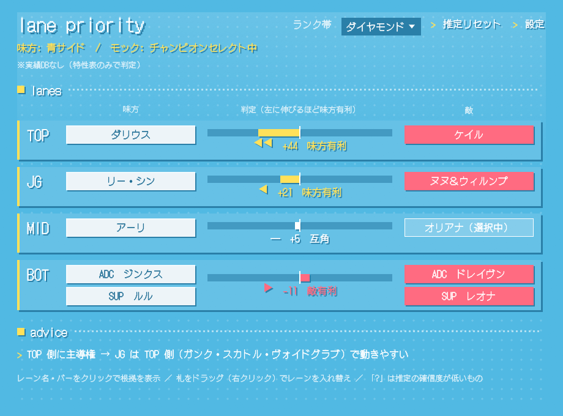

# レーン主導権（LoL レーン主導権判定アプリ）

チャンピオンセレクト中に、全レーン（TOP / JG / MID / BOT）の **序盤の主導権をどちらが取りやすいか** を
マッチアップから自動で判定して表示する Windows 用デスクトップアプリです。仕様は [SPEC.md](SPEC.md)。



## 使い方（配布版）

[Releases](https://github.com/alice3589/lol-lane-priority/releases) から `lane-priority-rust-win64.zip` を落として展開し、
`lane-priority.exe` を実行します。Rust や Visual C++ ランタイムなどのインストールは不要です（Windows 10 / 11 64bit）。

- クライアント無しで画面を試すには、ショートカットのリンク先の末尾に ` --mock` を付けて起動します
- `--offline` を付けると、起動時の Data Dragon（チャンピオン一覧）の更新確認をしません
- 署名していない exe なので、初回は SmartScreen の警告が出ます（「詳細情報 → 実行」）

LoL クライアントを先に起動しておく必要はありません。起動していなければ 5 秒ごとに探し直します。

## ビルド（開発者向け）

[Rust](https://rustup.rs/)（1.90 以上）が必要です。

```powershell
cd C:\Users\iwary\lol-lane-priority
cargo run --release -- --mock   # デモ表示
cargo run --release             # 本番（LoL クライアントに自動接続）
cargo build --release           # target\release\ に lane-priority.exe と collect-matches.exe ができる
```

- C ランタイムを静的リンクしているので（`.cargo/config.toml`）、exe は単体で動きます
- 手元の Rust 1.90 に合わせ、依存は Rust 1.90 で動く版に固定しています（eframe 0.33）

## 画面の見方

| 表示 | 意味 |
|---|---|
| バーが左に伸びる（黄色） | 味方有利。`◀` の数が多いほど差が大きい（10以上 / 30以上 / 60以上） |
| バーが右に伸びる（珊瑚色） | 敵有利 |
| 白「互角」 | スコアの絶対値が 10 未満 |
| 札の「?」・黄色の太枠 | 敵ポジションの推定確信度が 60% 未満 |
| 札の「（選択中）」 | まだロックしていない（ホバー中） |

- **レーン名かスコアバーをクリック**すると判定の根拠（各項目がスコアに何点効いているか）が開きます
- **札をドラッグ**して同じチームの別の札に落とすとポジションを入れ替えます（右クリックからも可）。
  入れ替えは次のチャンピオンセレクトが始まるまで保持され、「推定リセット」で元に戻ります
- **ランク帯**は右上で自由に選べます（実績DBを使うときに、どのランク帯のデータで判定するか）
- 根拠を開くと、敵のチャンピオンごとに**「それに有利なチャンピオン」の上位6体（カウンター候補）**が出ます。
  特性表（と実績DB）で採点し、そのポジションで10%以上使われるチャンピオンだけを対象にします（既にピック済みのチャンピオンは除外）。
  チップに触れると主な理由が出ます。ピック前でも、敵が決まっていれば見られます
- 下の「advice」は、主導権のあるサイドから見た JG の動き方の目安です
- 味方の札は白、敵の札は珊瑚色です。半透明の札はまだロックしていないチャンピオンです

## 判定のしくみ

スコアは味方視点の -100〜+100。

| 要素 | 内容 | 重み |
|---|---|---|
| A. 実績データ | 同マッチアップの 10分ゴールド差（主指標）・10分XP差・10分までのソロキル | 0.6 |
| B. チャンピオン特性 | 射程・序盤の強さ・ウェーブクリア・Lv6スパイク・機動力（JG はクリア速度・ガンク力・インベード耐性） | 0.3 |
| C. 補正 | 熟練度など | 0.1（**未実装**） |

- A は試合数が「必要試合数」（既定 200）に届かない分だけ重みを B に回します。実績DBが無ければ B だけで判定します
- C が未実装なので、最終的には A と B の重みで正規化しています（データ十分なら A:B = 2:1）
- BOT は ADC 同士と SUP 同士を項目ごとの比率で合算した 2v2 評価です
- 敵ポジションは、ロール出現率の積が最大になる割り当て（120 通り総当たり）で推定します。
  スマイトが見えていれば JG として扱います

## 実績データの集め方（任意）

Riot API はマッチアップ統計を直接くれないので、Match-V5 の試合を集めて自分で集計します。
[Riot Developer Portal](https://developer.riotgames.com/) で API キー（開発用キーは 24 時間で失効）を取得してください。

```powershell
$env:RIOT_API_KEY = "RGAPI-xxxxxxxx"
.\collect-matches.exe --platform jp1 --tiers GOLD,PLATINUM --players 30 --matches 20
```

- `collect-matches.exe` は `cargo build --release` で `target\release\` にできます。`lane-priority.exe` と同じ場所に置いて使います
- 保存先は既定で exe と同じ場所の `data\matchups.sqlite`（アプリが自動で読みます）
- 1試合ごとに保存し、取り込み済みの試合はスキップするので、Ctrl+C で止めても続きから再開できます
- 開発用キーのレート制限（20回/秒・100回/2分）を守るので、1試合あたり約 2.4 秒かかります
  （600 人×20 試合なら数時間〜）。実用的な精度には数万試合が必要です
- DB が溜まると、ロール出現率も同梱の概算値ではなく DB の値（50 試合以上あるチャンプ）を使います

| オプション | 既定 | 内容 |
|---|---|---|
| `--platform` | jp1 | jp1 / kr / na1 / euw1 など |
| `--tiers` | 全ランク帯 | `IRON,BRONZE,...,CHALLENGER` からカンマ区切り |
| `--players` | 20 | ランク帯ごとのプレイヤー数 |
| `--matches` | 20 | プレイヤーごとの試合数（最大 100） |
| `--db` | exe と同じ場所の data\matchups.sqlite | 保存先 |
| `--api-key` | 環境変数 RIOT_API_KEY | API キー |

## 設定

右上の「設定」から変更できます（`%APPDATA%\lol-lane-priority\settings.json` に保存）。

| 項目 | 内容 |
|---|---|
| lockfile の場所 | 空欄なら自動検出（よくあるインストール先 → 起動中プロセスのコマンドライン） |
| 実績DB | SQLite のパス（直接入力） |
| 実績データの必要試合数 | これ未満のマッチアップは特性表に寄せる |
| 使う直近パッチ数 | 0 で全パッチ |

## データファイル

3つとも exe に埋め込んでいます。値を変えたらビルドし直してください。

| ファイル | 内容 |
|---|---|
| `data/champions_ja.json` | Data Dragon のチャンピオン一覧（id・日本語名・射程・タグ）。起動時に最新版を取れたら `%APPDATA%` にキャッシュして差し替える |
| `data/champion_traits.json` | 特性表（1〜5 の手作業の概算値） |
| `data/role_rates.json` | ロール出現率（手作業の概算値） |

ロック・ザーヘン・ユナラは情報が少ないため値を推定しています（`_estimated`）。表に無い新チャンピオンは
Data Dragon のタグから既定値を作り、根拠欄に「特性値は推定」と出ます。

## デザインとフォント

画面のデザインは [alyce のサイト](https://alice3589.github.io/MySite/) に合わせています
（水色の背景にドット柄、黄色のアクセント、ぼかさないずらし影、「>」カーソル）。

文字は [DotGothic16](https://github.com/fontworks-fonts/DotGothic16)（SIL Open Font License 1.1、`assets/OFL.txt`）を
exe に埋め込んで使っています。DotGothic16 に無い記号（◀ ▶ など）は Windows の游ゴシックで補います。

## 規約について

- 使うのはクライアントがローカルに公開している API（LCU・Live Client Data）と Riot 公式 API だけです
- ゲームのメモリ読み取り・入力の自動化はしません。敵の情報はチャンピオンセレクトで見えるものだけを使います
- 他人に配布・公開する場合は、Riot Developer Portal でのアプリ登録と Production キーの申請が必要です

## テスト

```powershell
cargo test
```

`tests/golden.json` は、削除前の Python 版が出した計算結果です。`tests/parity.rs` で、Rust 版の結果が
これと一致する（1e-9 以内）ことを確かめています。判定ロジックを意図して変えたときは、このファイルも更新してください。

## 構成

```
src/
  main.rs                 画面（egui）・起動口（lane-priority.exe）
  sources.rs              取得元（LCU 接続・チャンセレ解析 / Live Client Data API / モック）
  role_inference.rs       ポジション推定
  scorer.rs               主導権スコア計算・JG の動き方の目安
  analyzer.rs             推定 → 計算 をまとめる
  matchup_db.rs           実績DB（SQLite）
  champions.rs            Data Dragon
  traits.rs               特性表・ロール出現率
  config.rs               設定・同梱データ
  collect.rs              Match-V5 収集・集計
  bin/collect-matches.rs  集計バッチの起動口
data/                     同梱データ
tests/
```

## 未実装（SPEC.md の v1 以降）

- F-11 熟練度による補正（スコア要素 C）
- F-12 試合後の答え合わせ（予測と実際の 10分ゴールド差の比較）
- F-13 パッチごとのデータ自動更新（今は手動でバッチを実行）
- F-14 読み上げ
